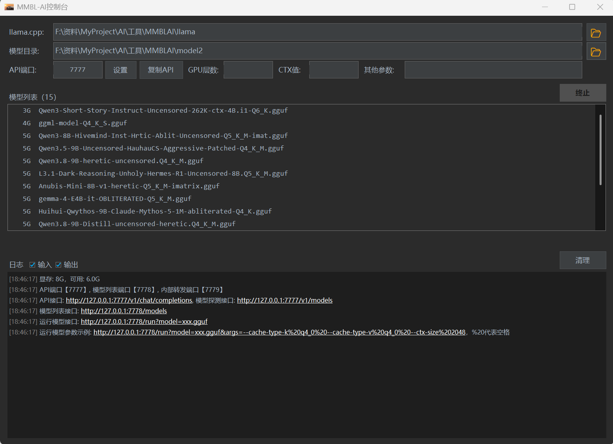
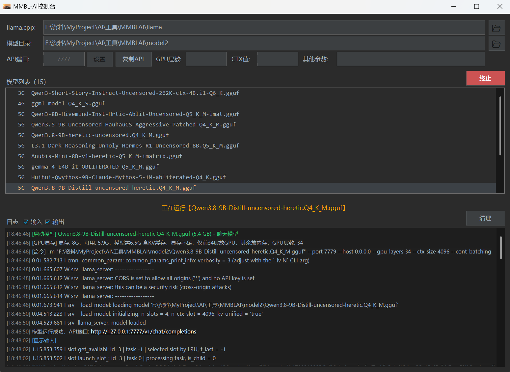
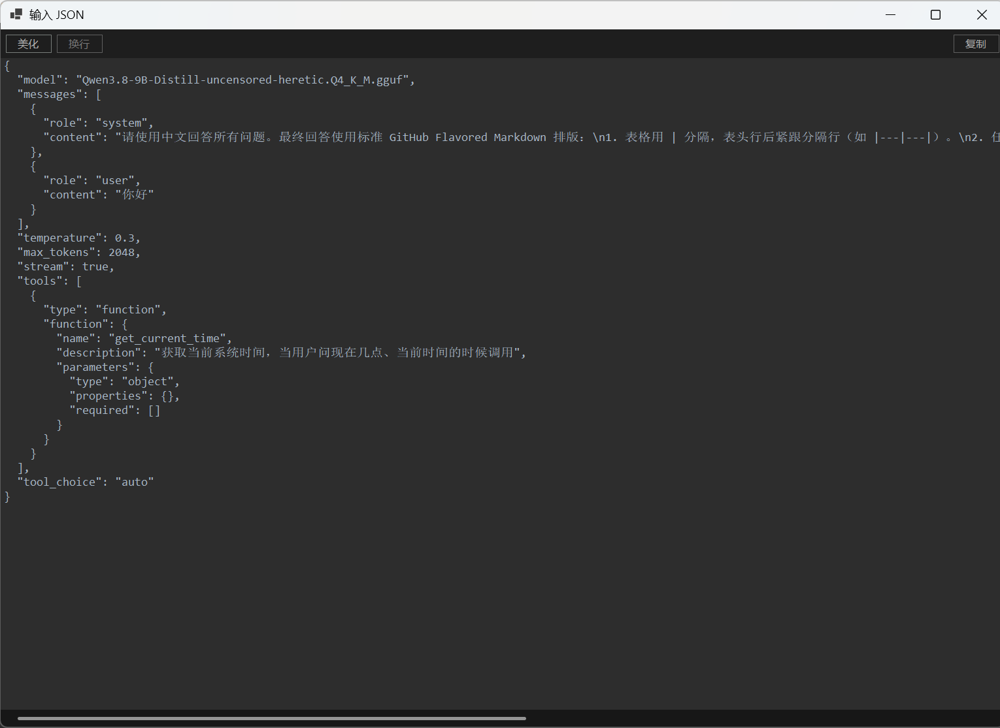
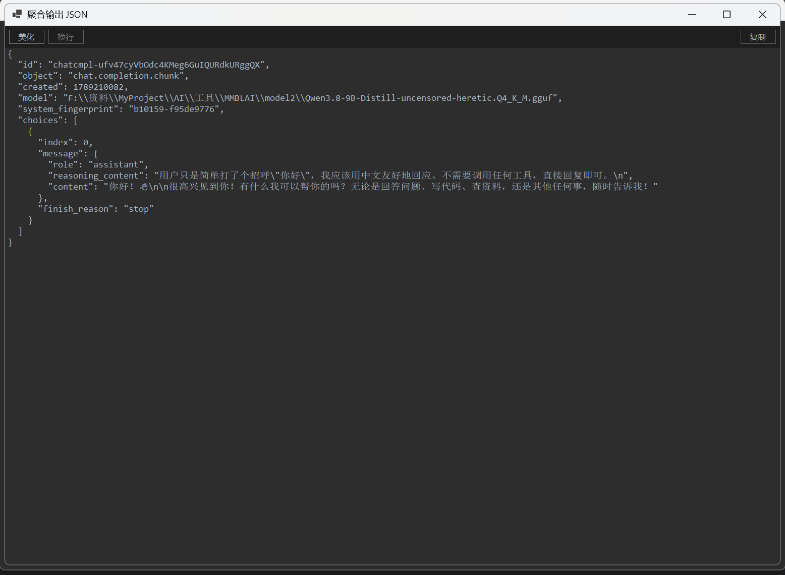

# MMBLAI

AI 本地模型管理器

一个基于 Windows 的本地跑 AI 模型的工具，使用 llama.cpp 调用本地 gguf 模型，并提供 OpenAI 兼容 API 接口。

替代庞大臃肿的Ollama；程序本体26M，双击即可使用；

## 功能

- 设置 llama.cpp 目录和本地模型目录
- 可按名称或大小排序模型
- 支持聊天模型，Embedding模型，Reranker模型
- 显存不足时，自动将部分推理层转移到系统内存中，保证模型可正常推理（速度变慢）。
- 配置端口、GPU 层数、上下文长度和其他启动参数
- 在 7777，7778 端口提供本地 OpenAI 兼容 API
- 控制台日志可显示Json格式的输入提示词和输出，用于调试Agent开发
- 系统托盘和运行状态管理

## 环境要求

- Windows10/11
- .NET 10 SDK

## 构建
运行脚本可生成exe
```powershell
一键打包.bat 
```

## 界面截图









## 模型资源

- [llama.cpp releases](https://github.com/ggml-org/llama.cpp/releases)
- [HF Mirror 国内模型下载站](https://hf-mirror.com/)
